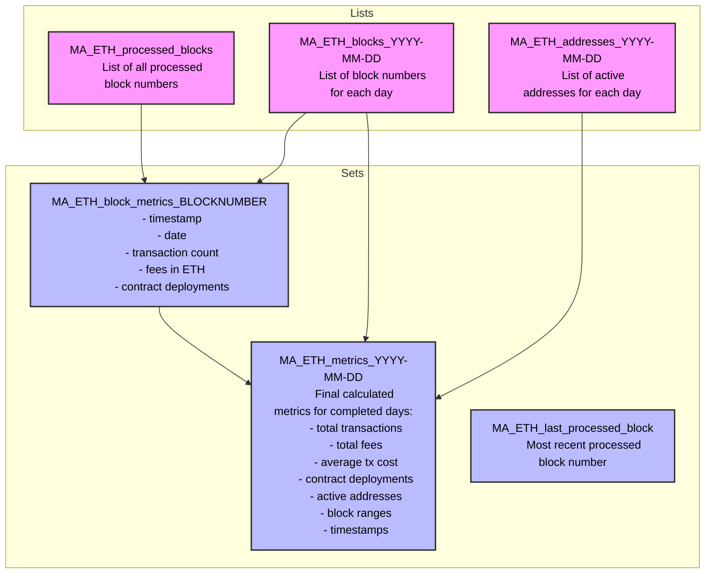

# Metrics API

A demonstreation of how to create a blockchain data analytics api with only QuickNode products and 0 additional infrastructure.

---

## Available Metrics:

- transactionCount: number of transactions
- tps: trasnactions that happened per second (not available in block data)
- averageTxCost: total fees / transaction count in native asset (i.e Ether on Ethereum)
- totalFees: total fees spent in native asset (i.e Ether on Ethereum)
- contractDeploymentCount: contracts deployed
- activeAddressCount: addreses that sent a transaction based on the "from" address (not available in block data)
- averageFeesPerBlock: total fees within block range / block count

---

## Requirements for Metrics API

### general

- support multiple chains (EVM only for now)
- minimize the number of KV Store reads when possible (cost & time)
- minimize function evocations when possible (cost)

### get data from Stream per block

- store the data in KV Store
- enable parallel streams to be running (time and fixes)

### enable reading from Functions as if an API service (which pulls data from KV Store)

- retrieve all or specific metrics for a given block or day
- retrieve all or specific metric average daily value for the prev 7, 30, or 90 days, as well as the value for the previous period before that so I can show if it has gone up or down and by how much
- retrieve specific metric timeseries data across 7, 30, or 90 days for charting

---

## Data Structure within Key Value Store

