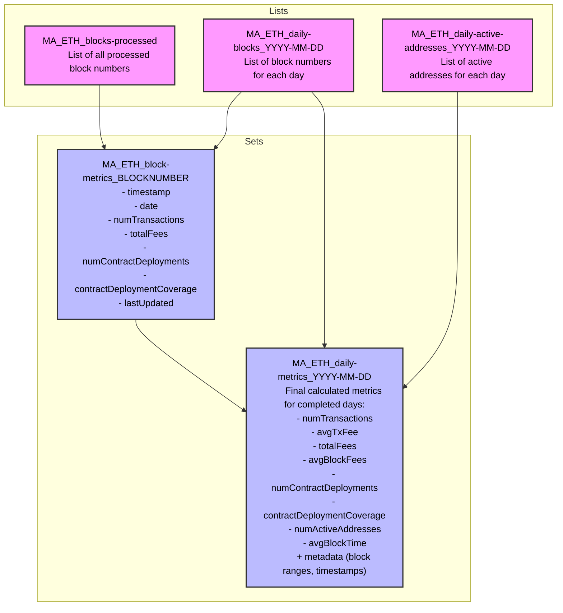

# Metrics API

A demonstration of how to create a blockchain data analytics api with only QuickNode products and 0 additional infrastructure.

---

## Available Metrics:

| Metric Name                | Description                                                         | Notes                                   |
| -------------------------- | ------------------------------------------------------------------- | --------------------------------------- |
| numTransactions            | Total number of transactions in the period                          |                                         |
| tps                        | Transactions per second                                             | Calculated as numTransactions/86400     |
| avgTxFee                   | Average transaction fee in native asset (e.g. ETH on Ethereum)      |                                         |
| totalFees                  | Total fees spent in native asset (e.g. ETH on Ethereum)             |                                         |
| avgBlockFees               | Average fees per block                                              | Total fees / number of blocks           |
| numContractDeployments     | Number of smart contracts deployed                                  |                                         |
| contractDeploymentCoverage | 'full' or 'partial' based on whether the chain supports Trace calls |                                         |
| numActiveAddresses         | Number of unique addresses that sent transactions                   | Based on transactions' "from" addresses |
| avgBlockTime               | Average seconds between blocks                                      |                                         |

---

## Requirements for Metrics API

### General

- support multiple chains (EVM only for now)
- minimize the number of KV Store reads when possible (cost & time)
- minimize function evocations when possible (cost)

### Get data from Stream per block

- store the data in KV Store
- enable parallel streams to be running (time and maintainability)

### Rnable reading from Functions as if an API service (which pulls data from KV Store)

- retrieve all or specific metrics for a given day (or latest)
- retrieve all or specific metric average daily value for the prev 7, 30, or 90 days, as well as the value for the previous period before that so I can show if it has gone up or down and by how much
- retrieve specific metric timeseries data across 7, 30, or 90 days for charting

---

## Data Structure within Key Value Store

