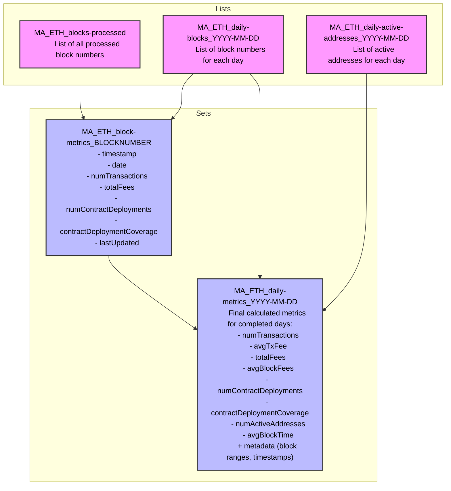

# Metrics API

A demonstration of how to create a blockchain data analytics api with only QuickNode products and 0 additional infrastructure.

**Tools Used**

- QuickNode Streams - [lander](https://www.quicknode.com/streams?utm_source=qn-github&utm_campaign=metrics-api) | [docs](https://www.quicknode.com/docs/streams/getting-started?utm_source=qn-github&utm_campaign=metrics-api)
- QuickNode Functions - [lander](https://www.quicknode.com/functions?utm_source=qn-github&utm_campaign=metrics-api) | [docs](https://www.quicknode.com/docs/functions/getting-started?utm_source=qn-github&utm_campaign=metrics-api)
- QuickNode Key-Value Store - [docs](https://www.quicknode.com/docs/key-value-store/getting-started?utm_source=qn-github&utm_campaign=metrics-api)

**Table of Contents**

- [Available Metrics](#available-metrics)
- [Project Details](#project-details)
- [API Methods](#api-methods)
  - [getPointMetrics](#getpointmetrics)
  - [getRollingMetrics](#getrollingmetrics)
  - [getTimeseriesData](#gettimeseriesdata)

<br>
<br>

## Available Metrics

| Metric Name                | Description                                                    | Notes                                   |
| -------------------------- | -------------------------------------------------------------- | --------------------------------------- |
| numTransactions            | Total number of transactions in the period                     |                                         |
| tps                        | Transactions per second                                        |                                         |
| avgTxFee                   | Average transaction fee in native asset (e.g. ETH on Ethereum) |                                         |
| totalFees                  | Total fees spent in native asset (e.g. ETH on Ethereum)        |                                         |
| avgBlockFees               | Average fees per block                                         | Total fees / number of blocks           |
| numContractDeployments     | Number of smart contracts deployed                             |                                         |
| contractDeploymentCoverage | 'full' or 'partial' based on if chain supports Trace calls     |                                         |
| numActiveAddresses         | Number of unique addresses that sent transactions              | Based on transactions' "from" addresses |
| avgBlockTime               | Average seconds between blocks                                 |                                         |

<br>
<br>

## Project Details

### Goals

✔️ provide a comprehensive blockchain analytics API
✔️ require 0 infrastructure outside of QuickNode tools `minimizes costs`
✔️ support multiple chains (EVM only for now)
✔️ minimize the number of KV Store reads when possible `minimizes costs` `improves efficiency`
✔️ minimize function evocations when possible `minimizes costs`

### Design

- QN Stream pipes data from blockchain
- Stream filter code processes and stores analytics data within QN KV Store
- Stream filter returns null, sending no data to a destination `minimizes costs`
- Stream filter logic & data structure in KV store are designed to enable parallel streams to be running `improves efficiency` `improves maintainability`
- QN Functions, one per method, read the data from KV Store and return convenient data structures
- Functions can be invoked via API

<details>
  <summary>Data Structure Within KV Store</summary>



</details>

<br>
<br>

## API Methods

### getPointMetrics

Get metrics for a specific date (or latest date that has been processed)

**Parameters**
| Name | Type | Required | Default | Description |
|------|------|----------|---------|-------------|
| chain | string | no | 'ETH' | Chain identifier |
| date | string, format: 'YYYY-MM-DD' | no | Most recent processed date | Calendar day, UTC |
| metric | string | no | 'all' | Specific metric name from [Available Metrics](#available-metrics) or 'all' |

<details>
<summary>Sample Request</summary>

```bash
curl -X POST "https://api.quicknode.com/functions/rest/v1/functions/228c88b3-30ed-4dcf-931b-74b521d50687/call?result_only=true" \
  -H "accept: application/json" \
  -H "Content-Type: application/json" \
  -H "x-api-key: YOUR_API_KEY" \
  -d '{
    "user_data": {
    }
  }'
```

</details>

<details>
<summary>Sample Response</summary>

```json
{
  "chain": "eth",
  "date": "2024-10-26",
  "blockRange": {
    "first": 21046077,
    "last": 21053236
  },
  "metrics": {
    "numTransactions": 1098532,
    "tps": 12.714490740740741,
    "avgTxFee": 0.0007861676927591663,
    "totalFees": 863.6303678621124,
    "avgBlockFees": 0.12061876646118888,
    "numContractDeployments": 4918,
    "contractDeploymentCoverage": "full",
    "numActiveAddresses": 357593,
    "avgBlockTime": 12.067048470456768
  }
}
```

</details>

<br>
<br>

### getRollingMetrics

Get average metrics over a period with period-over-period comparison

**Parameters**
| Name | Type | Required | Default | Description |
|------|------|----------|---------|-------------|
| chain | string | no | 'ETH'| Chain identifier |
| date | string, format: 'YYYY-MM-DD' | no | Most recent processed date | Last calendar day, UTC, of period |
| metric | string | no | 'all' | Specific metric name from [Available Metrics](#available-metrics) or 'all' |
| days | number | no | 7 | Period length. Enum: { 7 | 30 | 90 } |

<details>
<summary>Sample Request</summary>

```bash
curl -X POST "https://api.quicknode.com/functions/rest/v1/functions/d3c4d55f-0b93-46f9-9d9a-43801f5eaa9e/call?result_only=true" \
  -H "accept: application/json" \
  -H "Content-Type: application/json" \
  -H "x-api-key: YOUR_API_KEY" \
  -d '{
    "user_data": {
    }
  }'
```

</details>

<details>
<summary>Sample Response</summary>

```json
{
  "chain": "eth",
  "period": "7d",
  "currentPeriod": {
    "start": "2024-10-19",
    "end": "2024-10-26"
  },
  "previousPeriod": {
    "start": "2024-10-12",
    "end": "2024-10-19"
  },
  "daysWithData": {
    "current": 8,
    "previous": 8
  },
  "metrics": {
    "numTransactions": {
      "current": 1163362.875,
      "previous": 1198966.5,
      "changePct": -2.9695262544866767
    },
    "tps": {
      "current": 13.464848090277778,
      "previous": 13.876927083333333,
      "changePct": -2.9695262544866745
    },
    "avgTxFee": {
      "current": 0.001144308511116896,
      "previous": 0.0018347834169420943,
      "changePct": -37.63250198630882
    },
    "totalFees": {
      "current": 1331.2460393799215,
      "previous": 2199.8438516691035,
      "changePct": -39.484521214091835
    },
    "avgBlockFees": {
      "current": 0.18574662193106203,
      "previous": 0.30743398108715025,
      "changePct": -39.581622931133545
    },
    "numContractDeployments": {
      "current": 6981.75,
      "previous": 5647,
      "changePct": 23.636444129626348
    },
    "contractDeploymentCoverage": {
      "current": "full",
      "previous": "full",
      "changePct": null
    },
    "numActiveAddresses": {
      "current": 391765.125,
      "previous": 384237.25,
      "changePct": 1.9591736615853876
    },
    "avgBlockTime": {
      "current": 12.053578903306823,
      "previous": 12.072950876947802,
      "changePct": -0.16045765313240853
    }
  }
}
```

</details>

<br>
<br>

### getTimeseriesData

Get daily values for a specific metric over a period

**Parameters**
| Name | Type | Required | Default | Description |
|------|------|----------|---------|-------------|
| chain | string | no | 'ETH' | Chain identifier |
| date | string, format: 'YYYY-MM-DD' | no | Most recent processed date | Last calendar day, UTC, of period |
| metric | string | yes | - | Specific metric name from [Available Metrics](#available-metrics) |
| days | number | no | 7 | Period length between 1 and 90 |

<details>
<summary>Sample Request</summary>

```bash
curl -X POST "https://api.quicknode.com/functions/rest/v1/functions/f7fd3872-7554-40f9-b72c-ff3092f9925f/call?result_only=true" \
  -H "accept: application/json" \
  -H "Content-Type: application/json" \
  -H "x-api-key: YOUR_API_KEY" \
  -d '{
    "user_data": {
      "metric": "tps"
    }
  }'
```

</details>

<details>
<summary>Sample Response</summary>

```json
{
  "chain": "eth",
  "metric": "tps",
  "period": "7d",
  "dataPoints": [
    {
      "date": "2024-10-19",
      "value": 14.475011574074074
    },
    {
      "date": "2024-10-20",
      "value": 13.62962962962963
    },
    {
      "date": "2024-10-21",
      "value": 13.716481481481482
    },
    {
      "date": "2024-10-22",
      "value": 13.673287037037037
    },
    {
      "date": "2024-10-23",
      "value": 13.16855324074074
    },
    {
      "date": "2024-10-24",
      "value": 13.10494212962963
    },
    {
      "date": "2024-10-25",
      "value": 13.23638888888889
    },
    {
      "date": "2024-10-26",
      "value": 12.714490740740741
    }
  ]
}
```

</details>
